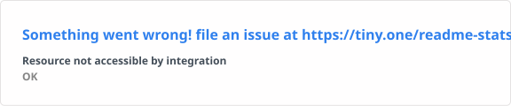

<!-- ===================================================== -->

<!--              DARSHAN GAVATE // PROFILE                -->

<!-- ===================================================== -->

<div align="center">


<br/>

### `> INITIALIZING DARSHAN.exe...`

**Developer • Builder • Open Source Enthusiast**

<br/>

<a href="https://github.com/darshangavate">
  
</a>

</div>

---

## ⚡ About Me

```javascript
const darshan = {
    name: "Darshan Gavate",
    username: "darshangavate",

    role: "Developer",

    interests: [
        "Full Stack Development",
        "Artificial Intelligence",
        "Open Source",
        "Creative Coding",
        "Building Real-World Projects"
    ],

    currentlyLearning: [
        "AI",
        "Backend Systems",
        "Modern Web Technologies"
    ],

    philosophy: "Build. Break. Learn. Repeat.",

    status: "Turning ideas into projects, one commit at a time ⚡"
};

console.log("Welcome to my GitHub universe 🚀");
```

---

<div align="center">

## 🧠 Tech Arsenal


<br/><br/>

`SYSTEM SKILLS █████████░ 90%`

</div>

---

## 📊 GitHub Intelligence

<div align="center">





</div>

<br/>

<div align="center">

`DATA SOURCE:// GITHUB ACTIONS`

`STATUS:// AUTO-UPDATING ⚡`

</div>

---

## 🚀 Current Mission

```text
╔══════════════════════════════════════════════╗
║                                              ║
║   🎯 BUILD   → Projects that stand out       ║
║   🧠 LEARN   → Powerful technologies         ║
║   ⚡ CREATE  → Things people remember        ║
║   🌍 GROW    → One commit at a time          ║
║   🤝 SHARE   → Contribute to open source     ║
║                                              ║
╚══════════════════════════════════════════════╝
```

---

## 🛰️ SYSTEM://DARSHAN

```yaml
identity:
  name: Darshan Gavate
  username: darshangavate

mode: DEVELOPER

system:
  curiosity: MAX
  creativity: MAX
  coffee: REQUIRED
  bugs: "temporary"
  learning: "continuous"

status:
  - Coding
  - Learning
  - Experimenting
  - Building
  - Contributing

interests:
  - Full Stack Development
  - Artificial Intelligence
  - Open Source
  - Creative Technology

current_objective:
  "Become dangerously good at creating useful things."

powered_by:
  - Curiosity
  - Creativity
  - Code
  - Music
  - Caffeine

system_status: ONLINE ⚡
```

---

## 🐍 Contribution Matrix

<div align="center">

<picture>

<source
 media="(prefers-color-scheme: dark)"
 srcset="https://raw.githubusercontent.com/darshangavate/darshangavate/output/github-contribution-grid-snake-dark.svg"
/>

<source
 media="(prefers-color-scheme: light)"
 srcset="https://raw.githubusercontent.com/darshangavate/darshangavate/output/github-contribution-grid-snake.svg"
/>


</picture>

</div>

---

## 💻 Featured Projects

<table>

<tr>

<td width="50%" valign="top">

<h3>
🔍 <a href="https://github.com/darshangavate/veriLens">veriLens</a>
</h3>

<p>
Fact-checking and credibility analysis platform built to help evaluate
information and identify potentially unreliable content.
</p>

<p>
<b>Tech:</b><br/>
React • Django • JavaScript
</p>

<a href="https://github.com/darshangavate/veriLens">
  
</a>

</td>

<td width="50%" valign="top">

<h3>
🧠 <a href="https://github.com/darshangavate/Skill-stream">Skill-stream</a>
</h3>

<p>
Adaptive skill-learning platform designed around personalized learning,
performance tracking and dynamic progression.
</p>

<p>
<b>Tech:</b><br/>
MongoDB • Express • React • Node.js
</p>

<a href="https://github.com/darshangavate/Skill-stream">
  
</a>

</td>

</tr>

</table>

<br/>

<div align="center">

<a href="https://github.com/darshangavate?tab=repositories">
  
</a>

</div>

---

## 🧪 Developer Console

```bash
darshan@github:~$ whoami
Darshan Gavate

darshan@github:~$ current-status
Building cool things...

darshan@github:~$ interests
Full Stack Development
Artificial Intelligence
Open Source
Creative Coding

darshan@github:~$ goal
Keep learning.
Keep building.
Keep shipping.

darshan@github:~$ █
```

---

## 📡 Current Signal

```python
while True:
    learn()
    build()
    fail()
    debug()
    improve()
    repeat()
```

> Every project is another level unlocked.

---

## 🌐 Find Me

<div align="center">

<a href="https://github.com/darshangavate">
  
</a>

</div>

---

<div align="center">

### ⚡ `while(alive) { learn(); build(); evolve(); }`

<br/>

**Thanks for entering my digital universe.**

<br/>

### `< DARSHAN />`

`SYSTEM://darshangavate`

<br/>


</div>
